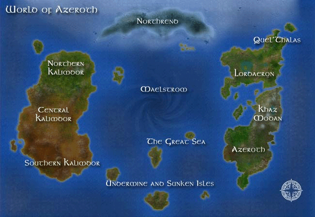
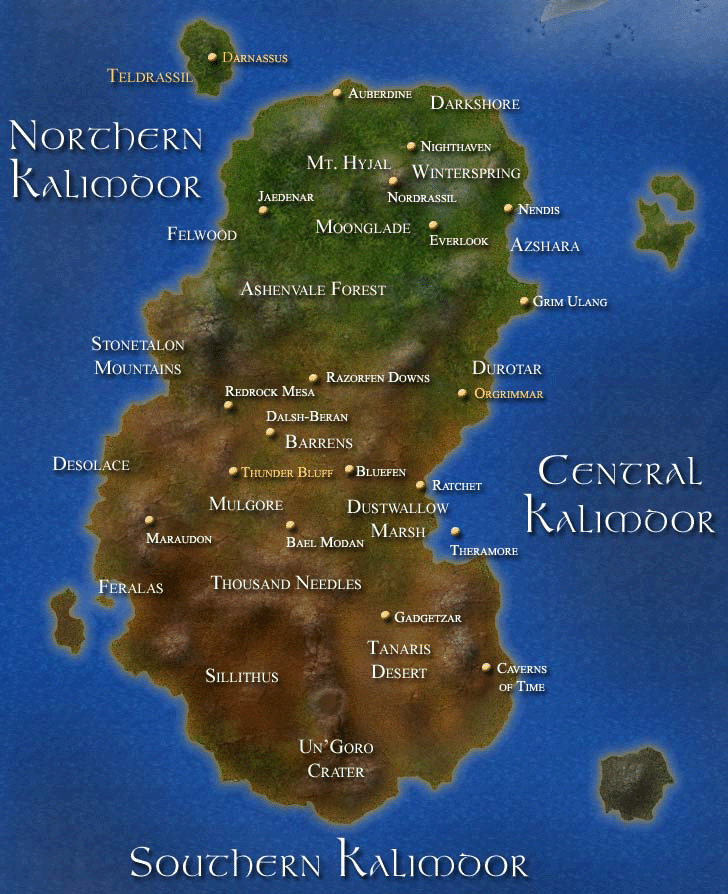
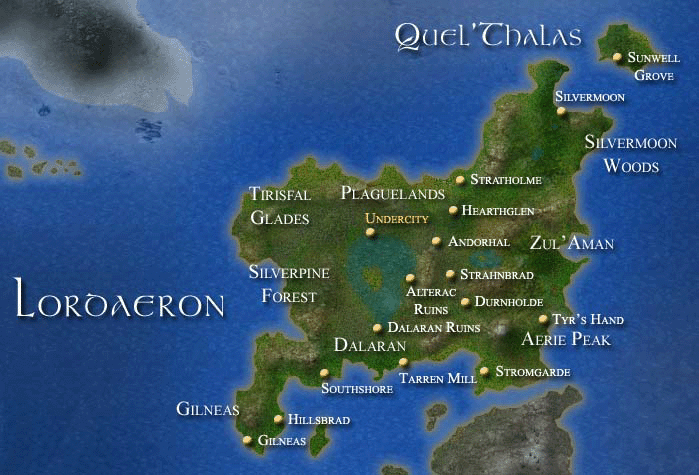
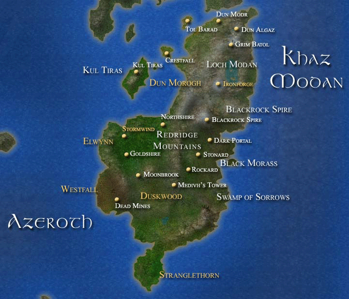
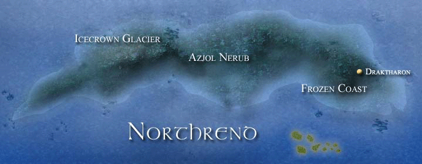
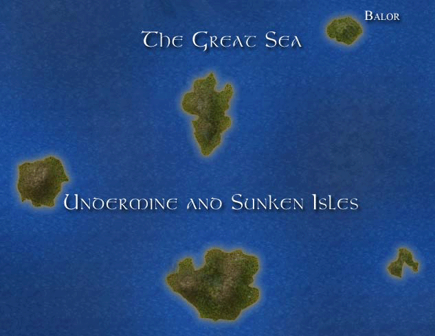

# Мир варкрафта
Мир Варкрафта богат, опасен, и необъятен. Королевства изо всех сил пытаются восстановиться после Третьей Войны, и накопить побольше сил. Огромные пространства остаются неизведанными, приглашая исследователей и искателей приключений опробовать местные опасности на вкус. Этот мир окружён Круговертью Пустоты, а если хорошо поискать, можно найти вход даже в другие планы существования.

## Калимдор

## Лордерон

## Азерот и Каз'Модан

## Нортренд

## Затонувшие острова и Шахта[^undermine]

[^undermine]: "Underminde" - название глубокой пропости под одним из островов.