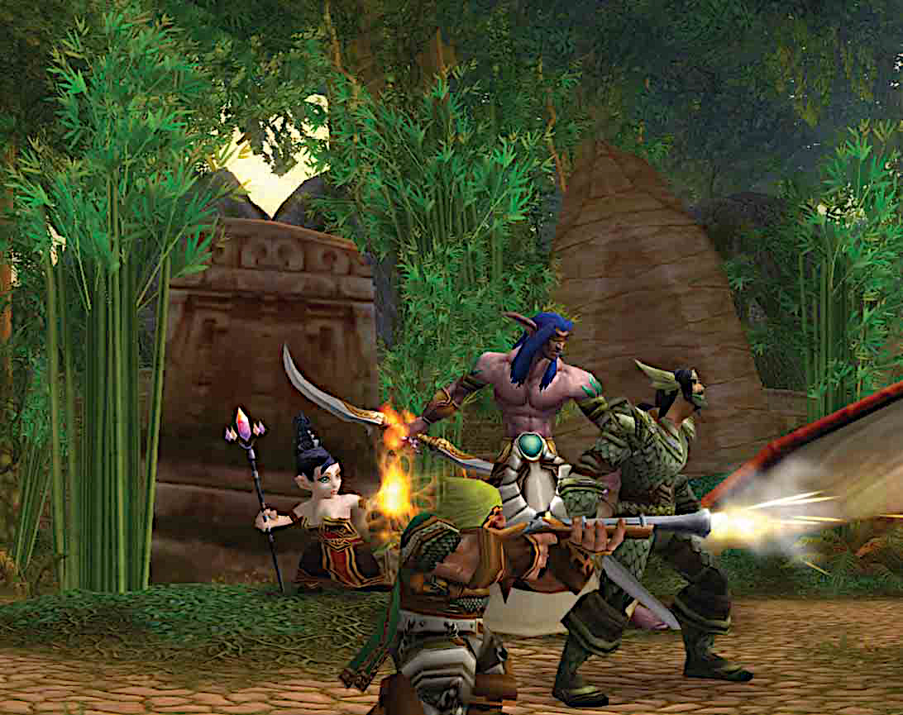

# Герои

> _История мира WarcraftRP вращается вокруг тебя, герой. Приключение, ведомое Мастером[^gm], фокусируется на воинах и целителях, некромантах и повелителях зверей, на тех, кто ведёт за собой армии, прячется в тени, сражается с демонами (иногда) и с нежитью, что пытается захватить их мир._

С получением уровней герои становятся более подготовлены к столкновению с опасностями. Персонажи получают навыки, черты, силы, и увеличивают значение своих атрибутов. Когда вы впервые создаёте персонажа, он получает 1 уровень. Это означает, что не смотря на слабые навыки, персонажи вышли за пределы мирной жизни и научились держать в руках меч, стрелять из лука, или творить заклинания.

[^gm]: "Game Master".