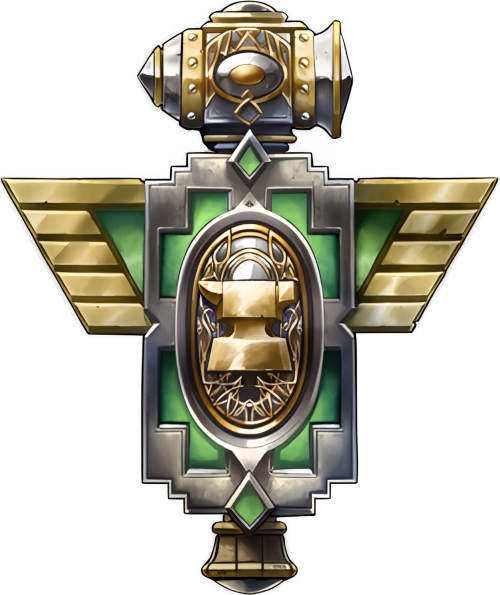

# Дварфы Стальгорна

<icon>Achievement_Character_Dwarf_Male.png</icon>
<icon>Achievement_Character_Dwarf_Female.png</icon>

## Описание
Дварфы очень горделивый, суровый, и решительный народ, не лишённый доброты, что скрыта под внешними строгими интерерами их прочных убежищ. Любовь к битвам, изобретениям, открытиям ведёт их по пути изучения их таинственного прошлого и открывает множество загадок о тех, кто их создал. Сравнительно недавно они обнаружили наследие своих древних прародителей, Титанов. Чем дальше дварфы погружаются в разгадку этой тайны, тем больше обнаруживают неизведанного. Кроме этого, тяга к изобретениям подталкивает их к созданию новых механизмов и изучению новых, эффективных способов разрушать. Одни из ярких примеров - конструирование паровых машин и огнестрельного оружия, что несомненно доказывает их таланты. Но после того, как дварфы прославились своими военными машинами они тут же охватились тягой к разгадке тайны своего рождения: после того как обнаружили следы Титанов по всему Лордерону, они распространились и по другим материкам, обустроив свои небольшие форпосты даже в самых отдалённых закоулках. На момент событий игры дварфы в основном занимаются изучением античных руин, или совершают экспедиции из разбросанных по всем материкам многочисленным форпостам с целью очищения мест раскопок от врагов.

## Внешность
Дварфы Стальгорна представляют собой плотно сложенный, мускулистый и сильный народ. Мужчины, как правило, носят длинные волосы и могучие бороды, заплетённые в богато украшенные косы. Женщины имеют такое же крепкое телосложение как и мужчины, однако лишены растительности на лице (несмотря на утверждения об обратном необразованных мудрецов других народов). Средний рост дварфов составляет полтора метра, а вес варьируется от шестидесяти до семидесяти.

## Регион
Дварфы обитают вокруг горы внутри которой находится их столица, [Стальгорн](../geography/kazmodan.md#Стальгорн-(город,-население-20-000)). Этот город был построен несколько тысяч лет назад, когда дварфы пробурили горную породу и оборудовали внутри неё роскошные залы. В Стальгорне обитают не только дварфы, но и их союзники - гномы. После того, как их столица, [Гномереган](../geography/kazmodan.md#Дун-Моро), была захвачена, они полностью переселились в Стальгорн. Столица находится на севере от [Вершины Дун Моро](../geography/kazmodan.md#Дун-Моро), прямо над озером [Лок Модан](../geography/kazmodan.md#Лок-Модан), прямо в центре [Каз Модана](../geography/kazmodan.md). Текущим правителем Стальгорна является Магни Бронзобород, который заведует социальной и культурной частью жизни, а так же, по возможности, сдерживает самых темпераментных воинов, ремесленников, и исследователей от неблагоразумных поступков.

## Принадлежность
Альянс. Не смотря на то, что дварфы уважают боевое мастерство [Орков](orcs/orcs.md), они не разделяют общий настрой Орды и негативно относятся к их союзникам [Троллям](trolls/trolls.md), и [Отрекшимся](forsaken/forsaken.md). Внутри альянса дварфы связаны коммерческими и дипломатическими обязанностями с [Высшими эльфами](highelves/highelves.md), но предпочитают держаться от жителей [Кель'Таласа](../geography/kaeltalas.md) на расстоянии вытянутых рук. [Ночные эльфы](nightelves/nightelves.md) кажутся дварфам очень подозрительными, однако их отношение пропитано уважительным трепетом. [Люди](humans/humans.md) в землях дварфов всегда желанные гости, и из всех народов дварфы относятся к ним лучше всего.

## Вера
Жрецы дварфов разделяют веру [Людей](humans/humans.md) и несут слово Света. В своей проповеди дварфы опираются на принципы и учения людей. Когда дварфы узнали, что их создали Титаны, они начали собирать информацию о своих создателях, и пришли к выводу, что те сопоставимы своим могуществом с богами, однако это не заставило их поклоняться Титанам, от чего религия Света так и осталась основной.

## Имена
Чаще всего имена дварфов отражают их натуру, а фамилия пренадлежит семье. Фамилии дварфов являются частью наследия семьи, и могут быть как благом почитаемым остальными, так и клеймом позора для всех потомков. Чаще всего новые фамилии дварфов зарождаются на службе или во время выполнения больших поручений, будь то поиск сокровищ или завоевание региона.  

### Мужские имена
* Бараб
* Арадун
* Торин
* Магни
* Гаррим
* Вендэл
* Таримар

### Женские имена
* Чис
* Хельга
* Фрея
* Фурга
* Крона
* Имли

### Фамилии
* Громокузнец
* Бронзобородый
* Зловещемолот
* Шипосталь
* Крепкогрохот

{.crest}