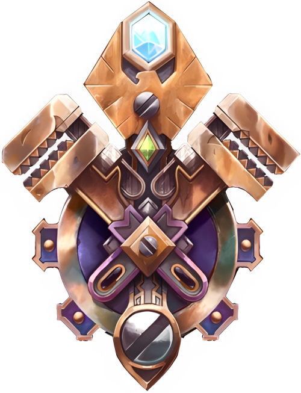

# Гномы

<icon>gnomemale.png</icon>
<icon>gnomefemale.png</icon>

## Описание
Гномы - небольшой добродушный народ, обитающий под землёй и увлекающийся изобретениями. Во время [Второй войны](../../history/timeline.md#6) именно они создавали транспорт и боевые устройства для Альянса - подводные лодки, летательные аппараты. Гномы прославились своими глубокими знаниями механических устройв и эксцентричным поведением.  
Столица гномов [Гномереган](../../geography/kazmodan.md#Дун-Моро), построенная в горе [Стальгорн](../../geography/kazmodan.md#Стальгорн-город-население-20-000) была захвачена `Троггами`, они разрушили город до основания и убили всех находившихся там жителей. Большая часть выживших перебралась в Стальгорн и теперь обитают бок о бок с [Дварфами Стальгорна](../dwarfes/dwarfes.md), но некоторые отправились вместе с другими дварфами на [Калимдор](../../geography/kalimdor.md). Гномы всё ещё не оправились от разрушения их механического города, поэтому стараются не покидать безопасных шахт дварфов, а те, кто обитает на Калимдоре, живут в уединённых деревнях [Бейл Модана](../../geography/kalimdor.md#Степи).
Даже после уничтожения своей столицы гномы остаются добросердечными и дружелюбными к другим народам, они легко заводят и сохраняют друзей, и чаще всего остальным тяжело не любить гномов. Живут гномы долго и по-отечески относятся в другим народам, в особенности к людям.
В текущее время общество гномов организовано слабо - большинство из них живут в [Каз Модане](../../geography/kazmodan.md) и оставляют дипломатические вопросы Дварфам Стальгорна, передавая свои просьбы через их представителей.
Особенность народа гномов в их даре ремесленных искуств и изобретениях. Они склонны к открытию новых методов работы и проектированию инновационных проектов, чаще всего они работают вместе с дварфами, составляя для них чертежи, по которым талантливые кузнецы в дальнейшем черпают вдохновение и реализуют концепции.

## Внешность
Гномы небольшие и худощавые, чем-то напоминают дварфов, но значительно ниже ростом и слабее сложены. У них большие носы и уши, румяная кожа, средне-густые волосы цвета от светло-жёлтого тонов до тёмно-коричневого. Часто гномов можно увидеть с очками и поясами с инструментами. 

Регион: Дун Морог. Большинство гномов все еще живут в Каз
Модане в королевстве гномов, в безопасности от Плети.
Те, кто отправился в Калимдор, живут в Баэль Модане, а
некоторые живут в Тераморе.

## Регион
[Дун Моро](../../geography/kazmodan.md#Дун-Моро). Большинство гномов живут в Каз Модане прячась от `Плети` в столице дварфов. Остальные обитают в `Баль Модане`, но некоторых можно найти и на [Тераморе](../../geography/kalimdor.md#Терамор-город-население-13-000).

## Принадлежность
Альянс. Гномы - большие друзья дварфов, они сражались и погибали вместе с ними на полях сражений в рядах армий людей. Гномы с опаской относятся к [Высшим эльфам](../highelves/highelves.md), но не более остальных, от чего не чувствуют себя слишком плохо по этому поводу. Во время [второй войны](../../history/timeline.md#6) гномы,  как и остальные народы, сражались бок о бок с [Ордой](../../geography/mood.md#Орда-и-Орда), и затаили на них обиду, хотя не смотря ни на что готовы дать всем второй шанс.
У Гномов особые отношения с [Гоблинами](../goblins/goblins.md) - на протяжении всего времени существования и по сей день они остаются соперниками. В зависимости от вовлечённых личностей такие соревнования могут быть дружескими, или довольно жестокими, на грани жизни и смерти. Что касается [Тауренов](../taurs/taurs.md) и [Ночных Эльфов](../nightelves/nightelves.md), они кажутся гномам довольно простоватыми в плане выражения чувств, но это не мешает Гномам дружить с ними. 

## Вера
Гномы полагаются на себя, своих друзей, и собственные изобретения. Некоторые следуют возвышенному чувству и воздают уважение `Свету`, другие же восхищены недавним открытием [Дварфов](../dwarfes/dwarfes.md) о [Титанах](../../history/timeline.md#летопись), создавших народ Стальгорна, и думают, что они тоже могут быть созданиями Титанов. Достоверность последнего факта поныне не определена, но если это правда, то очевиден тот факт, что гномы пока отчуждены от своих изначальных возможностей.

## Имена
Гномы дают имена своим детям при рождении, и, как правило, это имена почитаемых предков. По мнению общества гномов, по достижению 30 лет каждый из них должен достичь собственных достижений, и придумать себе собственное, новое имя, которое будет отражать уже только его личные заслуги. Это имя и заменяет данное родителями.

### Мужские имена
* Гробник
* Казбо
* Хагин
* Снунос

### Женские имена
* Беггра
* Нефти
* Сорасса
* Гамаш

### Фамильные имена
* Кручепистоль
* Лётонож
* Бомбомёт
* Круторуж

{.crest}