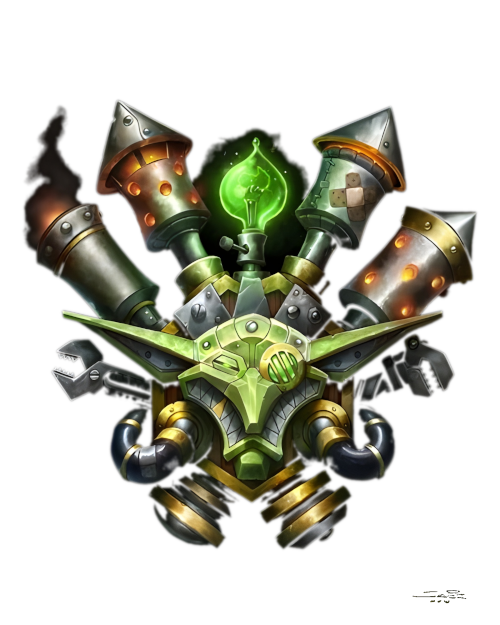

# Гоблины

<icon>race_goblin_male.png</icon>
<icon>race_goblin_female.png</icon>

## Описание
Гоблины - маленькие человекоподобные существа обладающие хитростью и проницательностью. Они склонны к торговле и инженерии, и их общество разделено на две касты: торговцев и механиков. Кроме того, гоблины - настоящие интриганы и мошенники, готовые на многое ради хорошей сделки.
Другие народы смотрят на гоблинов как на изобретателей, торговцев, и... психопатов. В подтверждение этому гоблины используют изобретения в торговле, и торговлю изобретениями, не забывая заламывать невозможные цены. Гоблины, определённо, основные пользователи технологий в этом магическом мире. 
В отличие от их коллег гномов, технологии гоблинов не экологичны и плохо влияют на окружающую природу. Огромные команды инженеров непрерываясь производят вредоносные гаджеты и боевые машины выбрасывающие зловонные газы в воздух.
У гоблинов очень рассееное внимание, и они достаточно часто переключаются с одного дела на другое. А повсеместное отсутствие дисциплины в дополнении к предыдущему факту приводят к тому, что большая часть изобретений оказываются законченой только на половину. 
Изобретения гоблинов заслужили репутацию ненадёжных, самовоспламеняющихся и периодически эффектно взрывающихся. Гоблины завидуют более стабильным механизмам дварфов и гномов, как с коммерческой, так и технолоигческой точки зрения. Как и остальные народы, гоблины признали, что огнестрельное оружие представляет новый источник силы, и те, кто контролирует этот источник, вероятно будет контролировать и горы золота - наивысшая сила для гоблинов. К счастью для остального мира, эксперименты с огнестрельным оружием у гоблинов не увенчались успехом, а порох, часто применяющийся при разработке такого оружия закончил карьеру очень многих начинающих гоблинов-мастеров.
Однако особенность работы гоблинов несколько раз неплохо окупилась; пороховое оружие гоблинов, как правило, очень неэлегантно и эффективно уничтожает всё, что находится в его радиусе поражения (мины, ракеты, пороховые бочки, бомбы, петарды, фейерверки, и даже то, что изначально не предполагалось взрываться). 
Гоблинскими владениями правят несколько "торговых принцев". Все они живут на [гоблинском острове в Шахте](../../geography/world.md#Затонувшие-острова-и-Шахта1) недалеко от [Водоворота](../../geography/maelstorm.md), где каждый из них контроллируют свою собственную армию и торговый флот. Все из них имеют собственную "специализацию" - монополию на торговлю в определённой области (горное дело, вырубка лесов, браконьерство). Торговые принцы, самые хитрые представители своего народа, не останавливаются ни перед чем в своей страсти к состоянию и власти использяу любые, в том числе и незаконные способы включающие в себя чёрный рынок и предательства.
Встречающиеся на [Калимдоре](../../geography/kalimdor.md) и [Восточных королевствах](../../geography/azeroth.md) гоблины чаще всего становятся наёмниками, каперами, и агентами торговых принцев [Шахты](../../geography/world.md#Затонувшие-острова-и-Шахта1). Все из них хорошие бойцы дальнего боя, использующие арбалеты и модфицированное гномское огнестрельное оружие. При переходе на ближний бой гоблины используют булавы, короткие мечи, и странное, самодельное оружие с паровыми элементами собранное из всяческого мусора и инструментов.
Гооблины отлично разбираются в тактике и стратегии ведения войны, а так же являются мастерами осадной войны. Их любовь к гигантизму и паровым машинам делает их идеальной мощью для разрушения всевозможных укреплений.
"Обмануть гоблина" - идиома гномов, означающая "сделать то, что практически невозможно" («Гамги
обманул гоблина, когда он сбежал из того обвала!»).
Основная миссия гоблинов в этом мире — создавать невероятные изобретения, накапливать полученные в результате их реализации богатства и причинять как можно больше скрытого вреда по пути.

## Внешность
Гоблины худые и жилистые гуманоиды в среднем 1 метра ростом и веса 15-25кг. У них длинные, острые носы, подбородки и уши, а также зеленая кожа. Их руки длинные и тонкие, с ловкими и сильным пальцами. Как правило, гоблины носят кожаную одежду, часто разрезанную в виде фартука для защиты от едких жидкостей. Обычно они ходят в очках и обмундированные различными технологическими устройствами на теле.

## Регион
Искатели приключений часто могут встретить гоблинов в составе торговых делегаций и пиратских банд. Гоблины часто бороздят моря перевозя или находясь в боиске богатсв, редких животных или экзотических товаров. Главный гоблинский порт Калимдора, город вечеринок Кабестан - портовый город, расположенный на восточном берегу [Степей](../../geography/kalimdor.md#Степи), между [Дуротаром](../../geography/kalimdor.md#Дуротар) и [Терамором](../../geography/kalimdor.md#Терамор-город-население-13-000). Так же гоблинов можно найти на форпостах, расположенных во всех крупных городах и маленьких поселениях, даже в таких негостеприимных условиях как [Нордскол](../../geography/northrend.md) и [Тернистая долина](../../geography/azeroth.md#Тернистая-долина). Но самый большой шанс встретить гоблинов - на дирижаблях, что курсируют между континентами перевозя пассажиров и пополняя и без того толстые кошельки маленьких психопатов.
По своей природе гоблины нейтральны, и стараются сделать так, чтобы их близкие клиенты ладили друг с другом. 

## Принадлежность
Независимость. Гоблины воевали на стороне Орды во время [Второй войны](../../history/timeline.md#6), но теперь принадлежат либо самим себе, либо тем, кто платит. Постоянная стройка и создание механических машин требуют огромных ресурсов для поддержания того, что ещё работает. Разбор старых изобретений позволяет только частично поддерживать экономическую стабильность, поэтому торговля с представителями всех народов сразу даёт возможность держаться им на плаву. Гоблины не злые, но и не добропорядочные, когда дело касается заработка. Они готовы заниматься любым теневым бизнесом: браконьерством, вырубкой лесов, контрабандой, бурением нефтяных скважин. Гоблины до мозга костей оппортунисты и наслаждаются бартером при любой удобной вохможности, поэтмоу они пытаются ужиться со всеми народами сразу - это часть их бизнеса. Другие народы смотрят на гоблинов не без подозрения, а [Ночные эльфы](../nightelves/nightelves.md) откоровенно недолюбливают их за неужавение к природе и её ресурсам. 

## Вера
Гоблины верят только в себя и золото. Они игнорируют такие не нематериальные концепции как шаманизм и Свет, предпочитая богов которых могут видеть, взвешивать и тратить.

## Имена
У каждого гоблина есть имя и фамилия. Фамилии отображают достижения предков, хотя гоблин может взять и новую, если  чувствует, что совершил достижение, превосходящее достижение его одноименного предка.

### Мужские имена
* Заутсо
* Бидл
* Чизболт
* Назак

### Женские имена
* Лыстис
* Мифира
* Сазайя
* Росса

### Фамильные имена
* Паромашинар
* Болтонос
* Челзажим
* Листогрыз

{.crest}