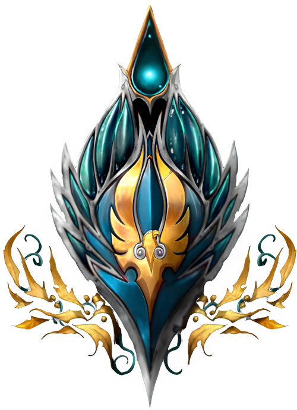

# Высшие Эльфы

<icon>highelfmale.png</icon>
<icon>highelffemale.png</icon>

## Описание
Древнее происхождение Высших эльфов наполнено трагедиями и конфликтами - длинная серия событий, глубоко повлиявшая на развитие Кель'дорай. Высшие эльфы резко контрастируют с их тёмными родственниками - [Ночными эльфами (Каль'дорай)](../nightelves/nightelves.md), они отринули окутывающую тенями ночь и приняли свет солнца, прямо как и их немногочисленные предки, вышедшие из народа эльфов, что служили королеве Азшаре во времена [Колодца Вечности](../../geography/maelstorm.md#Водоворот). Высшие эльфы склонны к частому использованию тайной магии, что Ночные эльфы считают беспечным и высокомерным. Именно эти черты привели Высших эльфов к `Войне Древних` а в итоге к краху золотого века эльфийской цивилизации, из-за чего раскол между Высшими и Тёмными эльфами стал так широк, что никакие дипломатические меры не в силах исцелить шрамы, пронизывающую историю обоих народов. Из-за безрассудного использования тайной магии Высшие эльфы в мир просочилась тьма и осквернила Азерот.
Для Высших эльфов тайная магия является пагубным пристрастием, толкающим эльфов на тёмный и опасный путь существования. Слишком многие из Высших эльфов делают вид, что этот тип магии безопасен, и лишь немногие старцы помнят почему использование тайной магии так опасно. Несмотря на риск, некоторые Высшие эльфы продолжают наслаждаться эйфорией от силы, которую приносит использование этой магии. Высшие эльфы - трагический пример народа, находящегося в упадке, и продолжающегося двигаться по нисходящей спирали вниз.
На текущий момент настоящих Кель'дорай осталось совсем мало. Большая часть из них ушла вместе с `Кель'тасом Солнечным Скитальцем`, стала называться `Кровавыми эльфами`, и присоединилась к заклятым врагам эльфийского народа - `Нагам`, в то время как оставшая скудная часть Кель'Дорай обратилась к Свету. Отвергнутые большинством народов, осташиеся Высшие эльфы стали изгоями, чьи сердца заполнены недоверием и горем.

## Внешность
Высшие эльфы немного выше чем средний человек, около 1.8м в высоту, и чуть легче среднего человека, от 45 до 65кг в зависимости от пола. Высшие эльфы стройные, с точёными, симметричными чертами лица, воплощающими истинную красоту.  Светлокожи, с волосами цветами от белого до льняного, и глазами насыщенного синего, зелёного, фиолетового, или красного цвета с небольшим сиянием на внутренней окружности.

## Регион
Высшие эльфы народ без дома. После уничтожения Кель'Таласа живым мертвецом `Кел'тузедом` и силами нежити во главе с`Принцем Артасом`, они небольшими группами скитаются по землям людей и живут в небольших сообществах или маленьких городках.

## Принадлежность
Альянс. Большая часть Высших эльфов приговорила себя к добровольному изгнанию стыдясь разрушительных последствий своей беспечности, однако люди всё ещё принимают Высших эльфов, так как они стараются загладить вину помогая им в битве с `Пылающим легионом`. В то же время остальные народы имеют дела с Высшими эльфами только если это необходимо, за исключением [Ночных эльфов](../nightelves/nightelves.md) которые открыто враждуют с Кель'дорай.

## Вера
Те Высшие эльфы, кто верит не только в магию избрали для себя путь Света, так же как и [Люди](../humans/humans.md) с [Дварфами](../dwarfes/dwarfes.md). Не смотря на то, что такая философия не проникла глубоко в сообщество Высших эльфов, те из них, кто проповедует религию идут на контакт более охотно.

## Имена
Прошлое большой груз для Высших эльфов, но не смотря на это они продолжают традицию имён, зародившуюся тысячалетие назад. Большая часть имён эльфийских жрецов и героев древности используются и поныне, и в них Высшие эльфы стараются отразить связь с солнцем.

### Мужские имена
* Мариэль
* Афаниар
* Анандор
* Тарама
* Виридиэль
* Маланиор

### Женские имена
* Анариэль
* Фрейя
* Дриана
* Кория
* Аланассори
* Азшара

### Фамилии
* Ветвистые странники
* Рассветные клинки
* Светоносные
* Утренний луч
* Солнцеходы

{.crest}