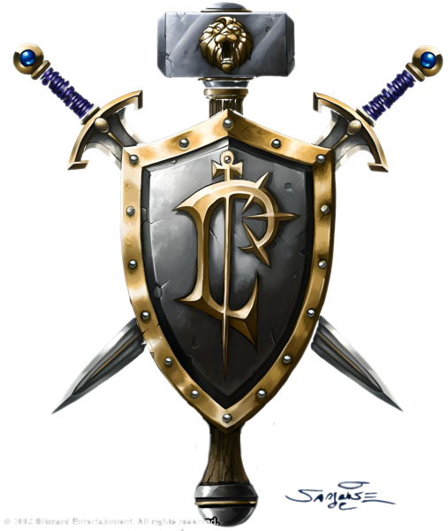

# Люди

<icon>humanmale.png</icon>
<icon>humanfemale.png</icon>

## Описание
Люди самый молодой, но и самый многочисленный народ в этом [мире](../../geography/world.md). Поскольку их продолжительность жизни, как правило, короче, чем у других народов, люди прилагают все усилия, чтобы достичь больших высот в развитии своей цивилизации, исследовании мира и изучении магии. Их активная и любознательная натура привела к тому, что они стали одним из самых влиятельных народов.
Однако так было только до первоначального вторжения орков через [Темный Портал](../../history/timeline.md). В результате вторжения и последующих трёх войн против [орков](../orcs/orcs.md) людские королевства сильно пострадали от [Орды](../../geography/mood.md#Альянс-и-Орда) и `Демонов`. Больше всего людей пало во время [Третьей войны](../../history/timeline.md), оставив после себя небольшую горстку непокорных выживших `Экспедиции Альянса` под командованием колдуньи `Джайны Праудмур`, которая повела их на [Калимдор](../../geography/kalimdor.md).
Людям из [Восточных королевств](../../geography/loarderon.md) повезло меньше. `Лордерон` разрушен `Плетью` и захвачен [Отрекшимися](../forsaken/forsaken.md), а пустоши вокруг стали полем битвы [Лесных троллей](../jungletrolls/jungletrolls.md) с `ограми` и агрессивной фауной. На `Лордероне` осталась лишь небольшая кучка изнурённых людей, постоянно борящихся за посягательства на свои маленькие поселения.
Королевство [Штормград](../../geography/azeroth.md#Штормград-метрополияmetropoly-население-200-000), первое, кто почувствовал на себе ярость орков, чувствует себя лучше остальных и на текущий момент единственное могущественное королевство людей. Однако `Штормграду` далеко от спокойствия - враги наступают со всех сторон и так и наровят захватить оставшуюся людскую территорию.
На народ людей выпало много препятствий, они поколениями боролись с тёмными силами и потеряли несколько величайших королевств. Эти потери озлобили людей и воспитали в них воинственный нрав, который вылился в новую модель дипломатии - вначале атака, затем выяснение обстоятельств.
Благодаря своей вере в `Свет` люди готовы выстоять против любых преград, и не смотря на все трагедии остаются выносливыми и храбрыми. В конце концов годы войны только закалили человеческую решимость, и они готовы действовать как никогда прежде.

## Внешность
Люди демонстрируют наибольшее физическое и социальное разнообразия среди всех народов. Цвет кожи варьируется от тёмной до светлой, и может иметь примеси других оттенков. Цвет глаз обычно приобретает голубой, карий, зелёный, или ореховый тон. Волосы у людей коричневые, чёрные, светлые, или рыжие. Мужчины часто отращивают короткие бороды, а женщины носят длинные волосы. Средний рост людей 1.8 метра, а вес около 80 кг - мужчины заметно выше и тяжелее женщин.

## Регион
Отплывшие вместе с `Джайной Праудмур` люди прибыли на южный [Калимдор](../../geography/kalimdor.md) и основали крепость под названием Терамор - небольшой каменный город окружённый стеной и расположенный на скалистом острове к востоку от [Пылевых топей](../../geography/kalimdor.md#Пылевые-топи). Остров граничит с [Дуротаром](../../geography/kalimdor.md#Дуротар), новой родиной орков на севере. Люди и [орки](../orcs/orcs.md) поддерживают неустойчивый мир вдоль границ, но столкновения происходят достаточно часто. Посколько большинство могущественных воинов и магов людей погибли во время войны с [Пылающим Легионом](../../history/timeline.md), на Тераморе осталась лишь горстка опытных магов и паладинов. На острове встречаются [Дварфы Стальгорна](../dwarfes/dwarfes.md) и [Высшие эльфы](../highelves/highelves.md), но люди на нём обладают абсолютной властью. Часто на остров прибывают [гоблины](../goblins/goblins.md)-торговцы.
Люди на востоке, на территории бывшего [Лордерона](../../geography/loarderon.md) могут похвастаться только небольшими разрозненными поселениями, далеко не такими величественными, как была прежде центральная крепость королевства. [Хиллсбрад](../../geography/loarderon.md#Предгорья-Хилсбрада) и [Кул-тирас](../../geography/loarderon.md#Кул-Тирас) в основном находятся под контролем людей, и ещё несколько маленьких деревень всё ещё целы в [Серебряном бору](../../geography/loarderon.md#Серебряный-бор) и [Альтеракских горах](../../geography/loarderon.md#Альтеракские-горы).
В южной части [Азерота](../../geography/azeroth.md) стоит `Штормград` - пострадавший в Первой и Второй войнах город, оставшийся относительно целым во время Третьей. `Штормград` полностью восстановлен и можно сказать что здесь империя людей и возрождается из пепла прошлого. Пусть `Плеть` и не добралась до этих территорий, но это небольшое город-государство сталкнуолось с собственными врагами, как внешними, так и внутренними. Тем не менее, `Штормград` является сильнейшим оплотом людей и символом возрождения.

## Принадлежность
Альянс. Люди основали Альянс, и он не может существовать без них. Четыре года назад Орда и Альянс объединили свои силы чтобы противостоять `Пылающему Легиону`, но как только опасность миновала, старое устройство мира вернулось вновь. Не смотря на то, что лидеры Альянса и Орды испытывают уважение друг к другу, старая ненависть всё равно живёт в их сердцах. Кроме [орков](../orcs/orcs.md), люди подозрительно смотрят на [тауренов](../taurs/taurs.md) из-за их связи с Ордой. 
В хороших отношениях находятся люди с [дварфами](../dwarfes/dwarfes.md) - эта связь только укрепилась в результате последних открытий дварфов. [Эльфы](../highelves/highelves.md) и их [Ночные родичи](../nightelves/nightelves.md) для людей остаются источником тайн и разочарований, а [тролли](../trolls/trolls.md) и [отрекшиеся](../forsaken/forsaken.md) видятся большой опасностью.

## Вера
Люди следуют `Свету`. Эта вера вдохновляет их дарит им цель и волю к победе. В городах и поселениях стоят величественные соборы и небольшие церкви, а священники внутри заботятся о пастве, исцеляют раненных, дают место отдыха уставшим, и идут в бой против сил зла вместе с остальными войнами. При церкви существует орден святых войнов, `Паладинов`, которые следуют по пути `Света` и сокрущают злых и хаотичных существ, такие войны полностью преданы защите людского народа.

## Имена
Люди получают имена при рождении, а их фамилии обычно имеют долгую историю и говорят о различном происхождении. Некоторые люди меняют свои фамилии, чтобы подчеркнуть свои достижения при жизни.

### Мужские имена
* Мерандер
* Гирам
* Даррик
* Херби

### Женские имена
* Лилла
* Мериан
* Рашель
* Ами

### Фамилии
* Ренн
* Городощит
* Среброкузн
* Руномаст
  
  
{.crest}