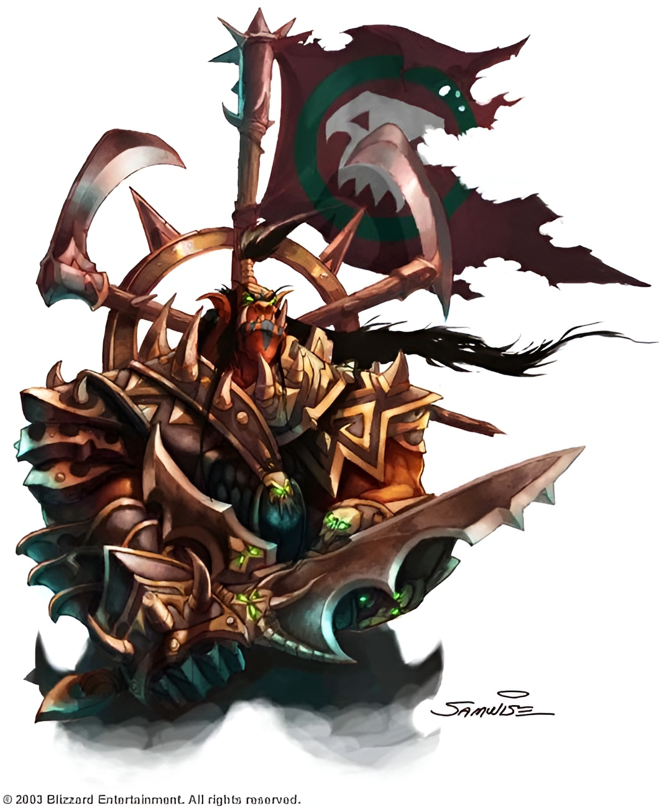

# Народы

Народы мира Warcraft разнообразны и многочислены - каждый из них по-своему влияют на мир вокруг и поступают в зависимости от данных клятв в различные периоды прошедших эпических событий. В этой главе содержится информация о [Дварфах Стальгорна](dwarfes.md), [Высших эльфах](highelves.md), [Ночных эльфах](nightelves.md), [Гномах](gnomes.md), [Гоблинах](goblins.md), [Людях](humans.md), [Орках](orcs.md), [Тауренах](taurs.md), [Троллях джунглей](trolls.md), и [Отрекшихся](forsaken.md).

В дополнениях будут представлены `Дварфы Громового Молота`, `Кровавые эльфы`, `Фурболги`, `Полуэльфы`, `Полуорки`, `Наги`, и `Пандарены`[^no]. Кроме того, в Книге Монстров представлено множество разных существ, большая часть из которых может быть использована для создания персонажа. 

> Если народ описывается в нескольких источниках, то данная книга имеет приоритет над всеми ними.

## Описание народов

[Таблица модификаторов](../tables/2-1.md)

Каждое описание народа представлено в формате:
* Описание - общие детали сосредоточенные на обществе и культуре.
* Внешность - описание физических и визуальных отличий.
* Регион - описание мест, где представители народа чаще всего обитают.
* Фракция - чаще всего народы примыкают либо к Орде, либо к Альянсу, но могут быть и исключения в виде независимых народов. В этом разделе так же можно найти информацию о том, как народ присоединился к той или иной фракции и как относится к ней сейчас.
* Религия - описание общего подхода народы к вере.
* Имена - список типичных имён для представителей народа.
* Черты народа - список и описание игровых черт, принадлежащих народу. 

> Черты из этой книги имеют приоритет над дополнениями.

> Некоторые народы могут брать уровни не в выборанном классе, в своём народе (см.дальше), в таком случае персонаж сможет выбрать и/или получить черты народа.

## Уровни народа

Некоторые народы выглядят на много могущественнее других, например, обычный `Таурен` на много сильнее среднего `Человека` и в целом может быть физически лучше его во всём. Чтобы не повторять ошибок первой редакции, в игре появились `Уровни народа`, которые позволили убрать штрафы к опыту для получения уровня.

`Уровни народа` позволяют персонажу получить особенные черты, и могут быть использованы только для своего народа. Кроме того, не стоит забывать, что такие уровни позволяют вашему персонажу больше проникнуться истинным духом своих соплеменников и увеличивает потенциал взаимодействия внутри общины. Можно сказать, что с каждым уровнем народа персонаж постигает всё больше традиций и перенимает опыт своих далёких предков.

> Не у каждого народа есть особенные уровни

`Уровни народа` работают точно так же как и обычные классы: у них есть кость здоровья, очки навыков, уровни, и всё остальное.

> Персонаж не получает штрафа за мультикласс выбирая уровень народа

Для таких уровней не существует ограничений по уровню, навыкам, характеристикам.

> Если у персонажа изменилась принадлежность (например, с помощью заклинания `Первращение`), он не может взять уровень народа отличный от его истинной природы, т.к. уровни народа отражают опыт предыдущих поколений конкретного народа, а не его физические особенности, из-за чего они не могут быть потеряны (при изменении принадлежности) или приобретены для неподходящего персонажа.  

[^no]: Материалы не выпущены, либо утеряны.