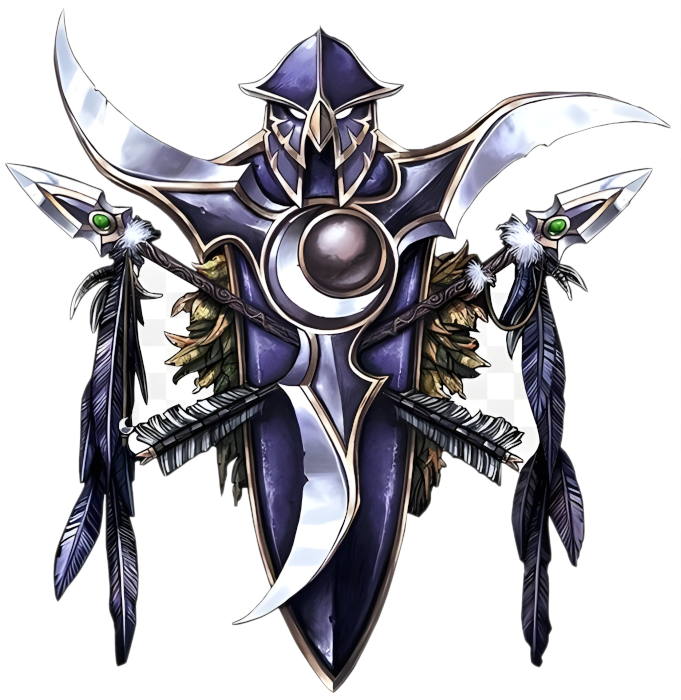

# Ночные Эльфы

<icon>nightelfmale.png</icon>
<icon>nightelffemale.png</icon>

## Описание
Каль'дорай древний и затворческий народ рождённый на заре этого мира. Древнее наследие превратило их в воинственный народ почитающий природу и анимистические практики. Как правило Каль'дорай практичны, но в то же время суеверны, от чего часто склонны к парадоксам. Представители народа одержимы глубокой духовной страстью и желанием найти утешение. В древности Каль'дорай были бессмертны, но эта могущественная магия была упущена Кель'дорай. Безрассудное использование магической силы позволило `Пылающему Легиону` вторгнуться в этот мир что привело к катострофической битве ныне известной как `Раскол`. Та битва изменила лик `Азерот` навсегда, и привела к созданию континентов, дрейфующих по поверхности планеты от огромного скопления энергии в центре океана, известного как [Водоворот](../../geography/maelstorm.md). Ночные эльфы честны до неприличия, справделивы как никто другой, и сострадательны к другим народам как заботливые родители. Однако они не доверяют большенству младших народов, так как видят в них глупых, недолговечныз существ, чьи ошибки забываются ими самими, но не Каль'дорай. Множество Ночных эльфов выбрали своим долгом стараться сохранять природный баланс на планете. Из-за высокомерного поведения и способностей Ночных эльфов к теневой магии младшие народы тоже предпочитают им не доверять.

## Внешность
Ночные эльфы обладают внушительным телосложением, их средний рост достигает двух и более метров. Мужчины очень мускулисты, бладают широкой грудью и плечами, тем самым подчёркивая невероятную силу, заложенную не только в их разуме, но и физическом теле. Женщины гибкие и округлые, но тоже мускулистые и сильные. У представителей обоих полов имеются длинные брови, выходящие за пределы лица, и длинные, островатые уши. Тон кожи варьируется от бледно-белого до синего или тёмно-красного, а волосы могут иметь цвет как ярко белый, так и практически чёрный, или природный оттенок листвы зелёного, жёлтого, оранжевого, или красного цвета. 

## Регион
Ночные эльфы обитают на островном континенте Тельдрассил, где находится их столица Дарнасс с массивными храмами и богатыми торговыми кварталами. Этот город одно из последних убежищ Каль'дорай, их союзников дриад и хранителей рощи. Однако "Корона земли" не лишена проблем. Фурболги, ведомые таинственной силой, ежедневно совершают вылазки к границам города. Кровожадные гарпии и дьявольские сатиры преследуют одиноких путников, и пытаются развратить их первоначальную суть. Большинство неопытных Каль'дорай оттачивают свои боевые навыки противостоя этим угрозам. Хотя Ночные эльфы и доверяют своим союзникам из Альянса, не многие люди или гномы видели Тальдрассил своими глазами. И только лишь некоторым удалось лицезреть священные `Лунные колодцы`. [Высшим эльфам](../highelves/highelves.md) не разрешается посещать земли Кель'дорай - если они будут обнаружены в землях Ночных эльфов, высокомерных Каль'дорай будет ждать быстрый и жестокий конец.

## Принадлежность
Альянс. Ночные эльфы союзники Альянса, но не самые доверенные и уважаемые. Такое отношение они заслужили своим недоверием к младшим народам. В сочетании с мистической внешностью и таинственной природой Кель'дорай, их взаимодействие с другими расами порой становится проблематичным.
Тем не менее, лидеры Ночных эльфов видят прок от союза с более молодыми народами - те всё чаще демонстрируют свой потенциал. Из-за этого Каль'дорай выступают в качестве наблюдателей, что готовы в любой момент вмешаться и исправить потенциально опасные ошибки. К тому же, другие расы помогают Ночным эльфам проявлять азарт, и с каждым новым поколением всё больше Каль'дорай начинают путешествовать в экзотические места.
Союз с [людьми](../humans/humans.md) и [дварфами](../dwarfes/dwarfes.md) укрепляется ещё и ненавистью Каль'дорай к [оркам](../orcs/orcs.md). После смерти `Кенария` во время `Третьей войны` многие `стражи`, `друиды`, и `воины` Ночных эльфов начали большую охоту на орков ради отмщения за смерть своего прежнего лидера. 

## Вера
Ночные эльфа поклоняются `Древним` - божествам природы, покровительствующим лесам и охоте. `Элуна` - богиня луны, и `Малорн` - дозорный, являются наиболее почитаемыми фигурами. Кроме богов природы эльфы почитают детей `Кенария` так же, как почитали его самого. И возможно благодаря такому почитанию дети полубога однажды окрепнут и помогут Ночным эльфам отплатить [оркам](../orcs/orcs.md) за прегрешения в прошлом

## Имена
Имена Ночных эльфов всегда несут в себе значение. Имена часто образуются от эльфийских слов или имён знаменитых героев и таким образом создают крепкую тотемную связь со своими предками. Фамилии же указывают на родословную и часто насчитывают тысячелетия.

### Мужские имена
* Илтилеор
* Мелитарн
* Хардон
* Андиссиэль
* Мердант
* Танавар

### Женские имена
* Кейна
* Деланта
* Меридия
* Фрейя
* Аланнария
* Невариаль

### Фамилии
* Лезвие луны
* Шторм глеф
* Гордый странник
* Дубоход
* Ночное крыло
* Олений рог

{.crest}