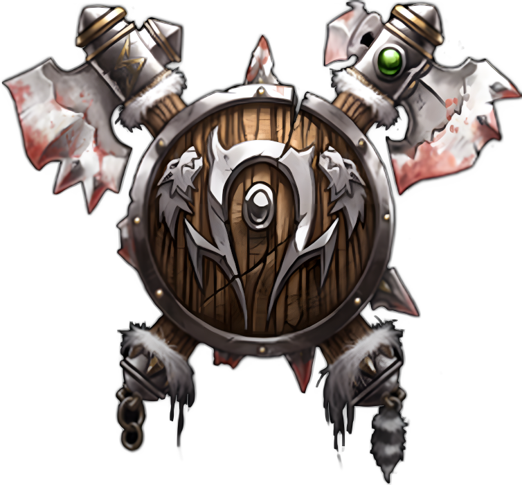

# Орки

<icon>orcmale.png</icon>
<icon>orcfemale.png</icon>

## Описание
Для врагов они жестокие и устрашающие противники не имеющие равных в свирепости и хитрости. Для союзников они благородные и честнолюбивые, следующие традициям своего прошлого. Орки из [Лордерона](../../geography/loarderon.md)являются частью народа, который снова обрёл свой истинный дух, избежав жестокие практики тайной и демонической магии ради пути мудрости и силы. Некоторые из орков всё ещё придерживаются тайных практик прошлого, но их время постепенно уходит. 
Хотя орки в бою жестоки и страстны, они сражаются не без грации подобной искусному фехтованию эльфийских дворян. Они чтят мастерство боя и почитают его великую силу. Именно концепция чести пронизывает орочье общество. Эта идеология сделала народ орков большой и сплочённой угрозой для Альянса.
Понятие чести пронизывает все слои общества - даже изначальное имя орка временно, он носит его пока не совершит обряд посвящения. Как только орк заслужил честь себе и своему клану, старейшины дают ему второе имя, основанное на его деянии.
Для орка честь важна так же, как и его клан. Большинство из них готовы умереть защищая репутацию клана или личную честь. 
Хотя орки взрывные и эмоциональные, их нрав сдерживается мудростью лидеров и шаманов. К текущему времени осталось совсем мало кланов поклоняющихся демонам, потому что и Альянс и Орда выслеживают и истребляют их. Большинство орков приняли жизнь, ведомую мудростью, честью и ценностями, воплощенными в лидерстве `Тралла`, как учил его наставник `Оргрим Молот Рока`.
Орки являются одним из самых многочисленных народов в мире Азерота. Хотя Альянс и воспринимает их как жестоких и диких, орки, несомненно, породили сложное общество, охватывающее множество занятий и других народов. Несомненно, лидерство `Тралла` и поддержка старейшин [тауренов](../taurs/taurs.md) и [троллей джунглей](../jungletrolls/jungletrolls.md) способствовали этой солидарности, но совершенно очевидно, что [людское](../humans/humans.md) общество недооценило способность орков объединяться и создавать свою собственную культуру. Возможно, со временем две фракции придут к пониманию, но с текущим разделением Альянса и Орды никто не может сказать, наступит ли между ними мир.

## Внешность
Орки мужчины - массивные и брутальные на вид существа. Весом они от 100 до 140 кг, а ростов от 1.8 до 2.1 метров. Женщины орки обычно всего на 15-30см ниже большинства мужчин (а некоторые из них и равны). Все орки широкоплечи и мускулисты. У орков, как правило, щетинистые волосы и бороды, часто черного или коричневого цвета. Их кожа принимает цвет от светло-зеленого до темно-оливкового, а глаза от ярко-красного до бледно-голубого. У орков широкие, плоские носы, и клыки, выступающие из нижней (а иногда и из верхней) челюсти, и большие, заостренные уши. Они предпочитают одежду из шкур, и вооружаются разнообразным тяжёлым оружием.

## Регион
[Дуротар](../../geography/kalimdor.md#Дуротар) является столицой народа орков. Названная `Траллом` в честь его отца `Дуротана`, эта земля занимает восточное побережье [Калимдора](../../geography/kalimdor.md). Здесь молодые орки находят возможность доказать свою честь в битвах с остатками племен `Иглошкурых` и встречают остальные различные угрозы, зарождающиеся в [Степях](../../geography/kalimdor.md#Степи). Вместе с орками в `Дуротаре` живут и племена [Троллей джунглей](../jungletrolls/jungletrolls.md).
[Оргриммар](../../geography/kalimdor.md#Оргримар-метрополия-население-16-000) служит центром цивилизации орков в засушливой и враждебной земле. Этот город является самым могущественным городом Орды в мире, здесь `Шаманы` консультируют молодежь и обучают духовных лидеров будущего, пока воины оттачивают своё мастерство в гладиаторских ямах и других жестоких состязаниях.

## Принадлежность
Орда. `Тралл` сформировал Орду с решительностью и чистой волей, создав союз народов, который потряс основы мира до его самого сердца. Уничтожив наследие `Грома Адского Крика` и выведя орков из глубин демонопоклонства, `Тралл` мудро и уверенно правит Ордой в Калимдоре. Орки являются такой же частью Орды, как и Орда является частью того, чем стали орки.

## Вера
Религия орков имеет форму анимистической веры, которая в некоторой мере соответсвует практикам [Каль'дорай](../nightelves/nightelves.md). Шаманы орков, так же как и ночные эльфы, черпают силу в духах природы, образуя тесную связь с
миром, который их окружает. Такой союз орков с природой привёл их к понимаю, что они живут в большей гармонии с миром,чем многие из народов Альянса, которые утверждают обратное.

## Имена
Большинство имен орков происходят от слов на их языке, имеющих сложное значение или скрытый смысл для их семей. Обычно это имя любимого предмета или родственника. Фамилии у орков отсутствуют, вместо них орки используют прозвища -  большинство из них связаны с каким-то великим подвигом героизма или чести. Однако, в случае действительно невероятных
подвигов, орк может взять прозвище своего отца, чтобы гарантировать, что летопись его поступка будет продолжать жить.

### Мужские имена
* Трум
* Дрог
* Горрум
* Харг
* Тхург
* Карг
* Громм
  
### Женские имена
* Громма
* Харгу
* Игрим
* Агра
* Драгга
* Грима

### Прозвища
* Молот рока
* Мёртвый глаз
* Связующий враг
* Убийца эльфов
* Крушитель черепов
* Потрошитель
* Рог слёз
* Разрушающий кулак
  
{.crest}